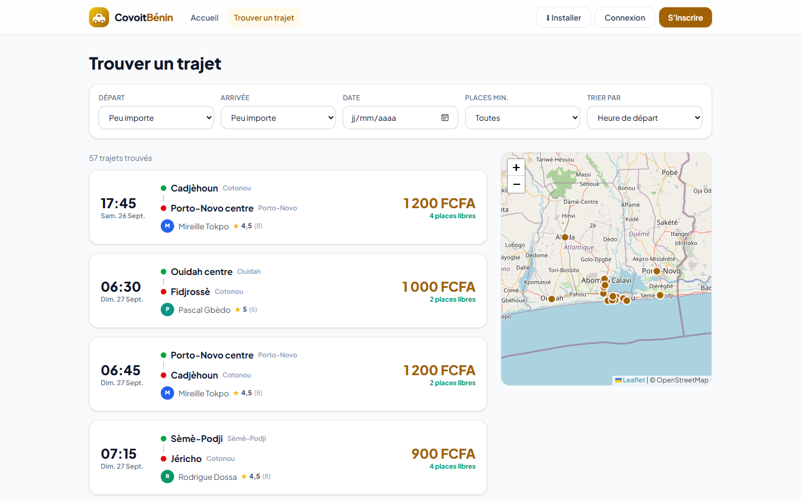
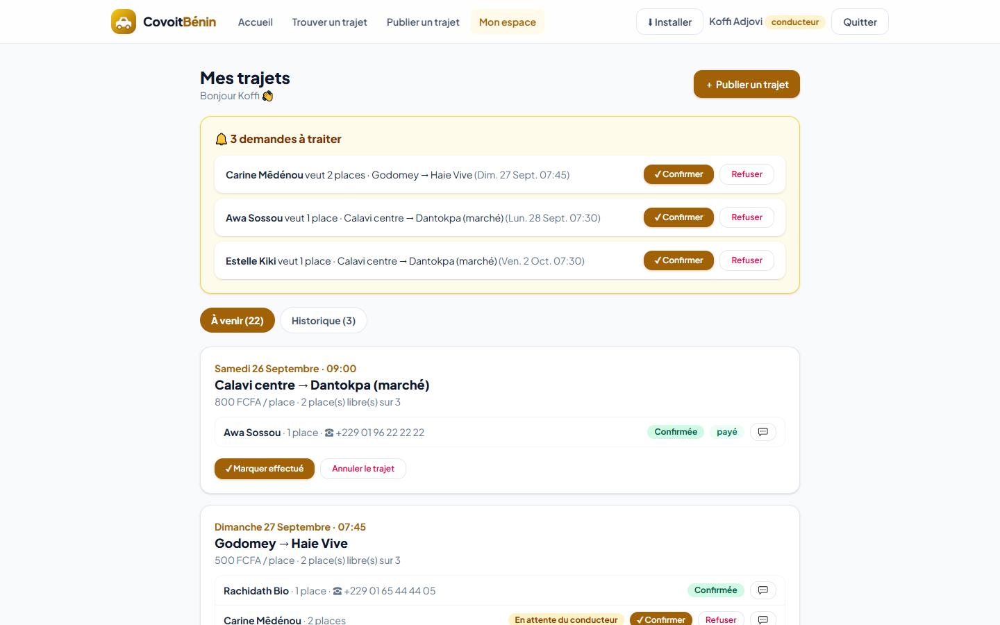

# CovoitBénin — Plateforme de covoiturage local

Mise en relation de conducteurs et de passagers pour des trajets urbains et interurbains récurrents
(Cotonou, Porto-Novo, Abomey-Calavi, Ouidah…), afin de réduire les frais de transport.
Projet n°5 du cahier des charges « 9 projets fictifs ».

**🔗 Démo en ligne :** https://mes-apps.wuaze.com/covoitbenin/ — **📲 Installer l’application** (mobile, tablette, ordinateur) : https://mes-apps.wuaze.com/covoitbenin/#/installer





## Fonctionnalités (MVP)

- Inscription en tant que **conducteur** ou **passager**
- Publication d’un trajet (départ, arrivée, date et heure, places disponibles, prix par place)
- Recherche de trajets par itinéraire et par date (et nombre de places), tri par heure ou par prix
- Demande de réservation d’une place par le passager, **confirmation ou refus par le conducteur**
- Historique des trajets effectués (conducteur et passager)

## Fonctionnalités avancées (bonus)

- **Paiement Mobile Money simulé** (MTN MoMo, Moov Money) après confirmation — aucune transaction réelle
- **Notation réciproque** conducteur / passager après un trajet effectué, note moyenne affichée partout
- **Messagerie intégrée** entre conducteur et passager pour chaque réservation
- **Trajets récurrents** : « tous les jours ouvrés » sur 1 à 4 semaines, créés en une fois
- **Carte interactive** (Leaflet + OpenStreetMap) : réseau de lieux, itinéraire de chaque trajet

## Règles métier

Une demande en attente ne bloque pas de place ; seules les réservations confirmées comptent (le conducteur ne peut pas
confirmer au-delà des places disponibles). Le téléphone n’est partagé qu’après confirmation. Un passager ne peut pas
publier de trajet, un conducteur ne peut pas réserver. Les notes ne sont possibles qu’après un trajet marqué « effectué ».

## Stack

| Composant | Technologie |
|---|---|
| Backend / API | Laravel 12, Sanctum (jetons Bearer) |
| Frontend | React 19 + Vite + Tailwind CSS 4 (dossier `frontend/`) |
| Cartographie | Leaflet.js |
| Base de données | MySQL |
| Documentation API | Collection Postman : [`docs/CovoitBenin.postman_collection.json`](docs/CovoitBenin.postman_collection.json) |

Modèle de données : `users (role, telephone)`, `lieux (nom, ville, lat, lng)`, `trajets`, `reservations`, `avis`, `messages`.

## Installation

```bash
composer install
cp .env.example .env            # renseignez la base MySQL
php artisan key:generate
php artisan migrate --seed      # lieux, conducteurs, passagers, trajets à venir et historique (jeu de données fictif)
php artisan serve
```

L’interface est déjà compilée dans `public/spa`. Pour la modifier : `cd frontend && npm install && npm run build`.
Tests : `php artisan test` (9 tests : inscription, recherche, places, paiement, notation, messagerie, annulation).

## Comptes de démonstration

| Rôle | E-mail | Mot de passe |
|---|---|---|
| Conducteur | `conducteur@covoitbenin.bj` | `demo1234` |
| Passagère | `passager@covoitbenin.bj` | `demo1234` |

Personnes, trajets et paiements fictifs. Cartes © OpenStreetMap.

Auteur : [Sedjame Vianney](https://sedjame-vianney.vercel.app)
